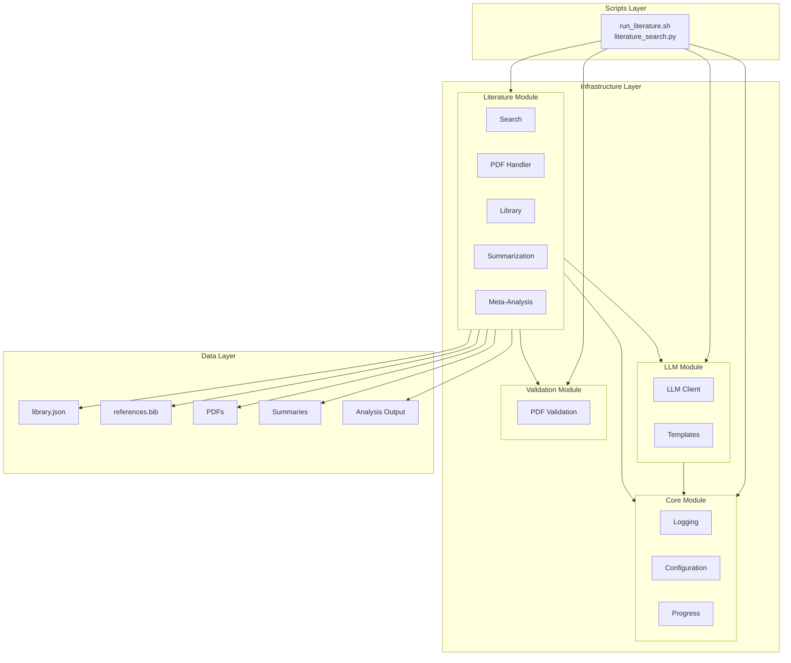
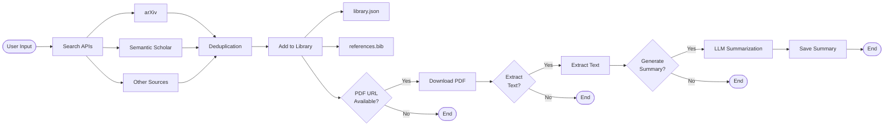
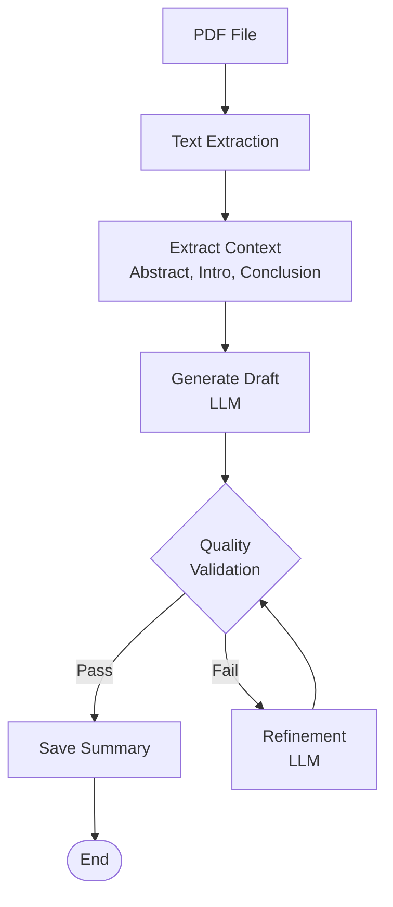
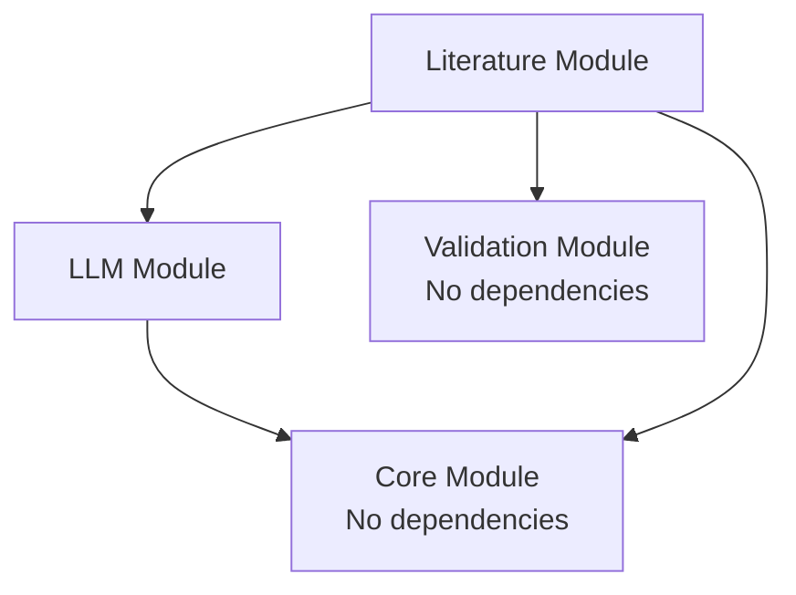
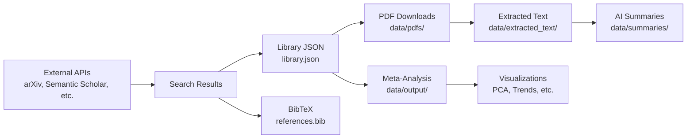

# Literature Search and Management System

Standalone repository for academic literature search, PDF management, reference tracking, and LLM-powered paper summarization.

## Quick Navigation

**I want to...**
- **Get started quickly** → [Quick Start](#quick-start) | [Getting Started Guide](docs/getting-started.md)
- **Search for papers** → [Searching Papers Guide](docs/guides/search-papers.md) | [Python API](#python-api)
- **Generate summaries** → [Summarizing Papers Guide](docs/guides/summarize-papers.md)
- **Run meta-analysis** → [Meta-Analysis Guide](docs/guides/meta-analysis.md)
- **Configure the system** → [Configuration Guide](docs/guides/configuration.md) | [Quick Config](#configuration)
- **Understand the architecture** → [System Overview](#system-overview) | [Architecture Documentation](docs/architecture.md)
- **Troubleshoot issues** → [Troubleshooting Guide](docs/guides/troubleshooting.md)
- **Use the API/CLI** → [API Reference](docs/reference/api-reference.md) | [CLI Reference](docs/reference/cli-reference.md)

**For different users:**
- **Users** → Start with [Getting Started](docs/getting-started.md) and [Quick Start](#quick-start)
- **Developers** → See [System Overview](#system-overview), [Module Reference](#module-reference), and [API Reference](docs/reference/api-reference.md)
- **Researchers** → See [Core Workflows](#core-workflows), [Meta-Analysis Guide](docs/guides/meta-analysis.md), and [LLM Operations](docs/guides/llm-operations.md)

## Features

- **Multi-Source Search**: Unified search across arXiv, Semantic Scholar, PubMed, CrossRef, OpenAlex, DBLP, and more → [Search Guide](docs/guides/search-papers.md)
- **PDF Management**: Automatic downloading with citation key naming, parallel downloads, and open access fallback → [PDF Documentation](infrastructure/literature/pdf/AGENTS.md)
- **Failed Download Tracking**: Automatic tracking of failed downloads with retry capability → [Troubleshooting](docs/guides/troubleshooting.md#pdf-download-failures)
- **Reference Management**: BibTeX generation with deduplication and library indexing → [Library Documentation](infrastructure/literature/library/AGENTS.md)
- **LLM Summarization**: Local LLM-powered paper summarization with quality validation → [Summarization Guide](docs/guides/summarize-papers.md)
- **Meta-Analysis**: PCA, keyword analysis, temporal trends, and visualization tools → [Meta-Analysis Guide](docs/guides/meta-analysis.md)
- **Library Tracking**: JSON-based index with metadata and progress tracking → [Data Formats](docs/reference/data-formats.md)

## System Overview

The system follows a layered architecture with thin orchestrator scripts coordinating infrastructure modules:



**Architecture Principles:**
- **Standalone Design**: No dependencies on external systems → [Architecture Details](docs/architecture.md)
- **Thin Orchestrator Pattern**: Business logic in infrastructure, scripts coordinate workflows
- **Modular Architecture**: Independent, well-documented modules → [Module Documentation](#module-reference)

## Quick Start

### Installation

```bash
# Clone the repository
git clone <your-repository-url>
cd literature

# Install dependencies
uv sync
# or
pip install -e .
```

### Basic Usage

```bash
# Interactive menu
./run_literature.sh

# Search for papers
python3 scripts/literature_search.py --search --keywords "machine learning,deep learning"

# Download PDFs for existing entries
python3 scripts/literature_search.py --download-only

# Retry previously failed downloads
python3 scripts/literature_search.py --download-only --retry-failed

# Generate summaries (requires Ollama)
python3 scripts/literature_search.py --summarize

# Meta-analysis pipeline
python3 scripts/literature_search.py --meta-analysis --keywords "optimization"
```

See [Getting Started Guide](docs/getting-started.md) for detailed instructions.

### Python API

```python
from infrastructure.literature import LiteratureSearch, LiteratureConfig

# Initialize
config = LiteratureConfig.from_env()
searcher = LiteratureSearch(config)

# Search
papers = searcher.search("machine learning", limit=10)

# Process results
for paper in papers:
    print(f"{paper.title} ({paper.year})")
    
    # Add to library (BibTeX + JSON)
    citation_key = searcher.add_to_library(paper)
    
    # Download PDF
    if paper.pdf_url:
        pdf_path = searcher.download_paper(paper)
        if pdf_path:
            print(f"  PDF: {pdf_path}")
```

See [API Reference](docs/reference/api-reference.md) for API documentation.

## Core Workflows

### Search and Library Workflow



### Summarization Workflow



### Module Dependencies



### Data Flow



## Documentation Map

### Getting Started
- **[Getting Started Guide](docs/getting-started.md)** - Quick start guide
- **[Architecture Overview](docs/architecture.md)** - System architecture and design

### User Guides
- **[Searching Papers](docs/guides/search-papers.md)** - How to search for papers
- **[Summarizing Papers](docs/guides/summarize-papers.md)** - How to generate summaries
- **[Meta-Analysis](docs/guides/meta-analysis.md)** - Running meta-analysis
- **[Configuration](docs/guides/configuration.md)** - System configuration
- **[LLM Operations](docs/guides/llm-operations.md)** - Multi-paper LLM operations
- **[Troubleshooting](docs/guides/troubleshooting.md)** - Troubleshooting guide

### Module Documentation
- **[Infrastructure Overview](docs/modules/infrastructure.md)** - Infrastructure layer overview
- **[Core Module](docs/modules/core.md)** - Foundation utilities
- **[LLM Module](docs/modules/llm.md)** - Local LLM integration
- **[Literature Module](docs/modules/literature.md)** - Literature search and management
- **[Validation Module](docs/modules/validation.md)** - PDF validation and text extraction

### Reference Documentation
- **[API Reference](docs/reference/api-reference.md)** - API documentation
- **[CLI Reference](docs/reference/cli-reference.md)** - Command-line interface reference
- **[Data Formats](docs/reference/data-formats.md)** - Data structure documentation

### Module-Specific Documentation
- **[Literature Module AGENTS.md](infrastructure/literature/AGENTS.md)** - Literature module details
- **[Literature Module README](infrastructure/literature/README.md)** - CLI reference
- **[Core Module AGENTS.md](infrastructure/core/AGENTS.md)** - Core utilities
- **[LLM Module AGENTS.md](infrastructure/llm/AGENTS.md)** - LLM integration
- **[System AGENTS.md](AGENTS.md)** - System documentation

### Additional Resources
- **[Documentation Index](docs/README.md)** - Documentation index

## Module Reference

### Infrastructure Core (`infrastructure/core/`)
Foundation utilities: logging, configuration, progress tracking, retry logic, exceptions → [Core Module](docs/modules/core.md) | [AGENTS.md](infrastructure/core/AGENTS.md)

### LLM Module (`infrastructure/llm/`)
Local LLM integration: Ollama client, prompt templates, context management, validation → [LLM Module](docs/modules/llm.md) | [AGENTS.md](infrastructure/llm/AGENTS.md)

### Literature Module (`infrastructure/literature/`)
Literature search and management: multi-source search, PDF handling, library management, summarization, meta-analysis → [Literature Module](docs/modules/literature.md) | [AGENTS.md](infrastructure/literature/AGENTS.md) | [README](infrastructure/literature/README.md)

### Validation Module (`infrastructure/validation/`)
PDF validation and text extraction: multi-library support with automatic fallback → [Validation Module](docs/modules/validation.md) | [AGENTS.md](infrastructure/validation/AGENTS.md)

## Directory Structure

```
literature/
├── run_literature.sh          # Main orchestrator script
├── scripts/                    # Orchestrator scripts
│   ├── literature_search.py
│   └── bash_utils.sh
├── infrastructure/             # Core modules
│   ├── core/                   # Foundation utilities
│   ├── llm/                    # LLM integration
│   ├── literature/             # Literature search modules
│   └── validation/             # PDF validation
├── tests/                      # Test suite
│   └── infrastructure/
├── data/                       # Data directory
│   ├── library.json            # Paper metadata index
│   ├── references.bib          # BibTeX bibliography
│   ├── summarization_progress.json # Summarization progress tracking
│   ├── failed_downloads.json  # Failed download tracking
│   ├── pdfs/                   # Downloaded PDFs
│   ├── summaries/              # AI-generated summaries
│   ├── extracted_text/         # Extracted PDF text
│   ├── embeddings/             # Cached embedding files (JSON)
│   └── output/                 # Meta-analysis outputs
└── docs/                       # Documentation
```

See [Data Formats](docs/reference/data-formats.md) for detailed data structure documentation.

## Output Files

All outputs are saved to the `data/` directory:

- **`data/library.json`** - JSON index with paper metadata → [Data Formats](docs/reference/data-formats.md#library-index-libraryjson)
- **`data/references.bib`** - BibTeX entries for citations → [Data Formats](docs/reference/data-formats.md#bibliography-referencesbib)
- **`data/summarization_progress.json`** - Summarization progress tracking (auto-generated)
- **`data/failed_downloads.json`** - Failed download tracker (auto-generated)
- **`data/pdfs/`** - Downloaded PDFs (named by citation key)
- **`data/summaries/`** - AI-generated summaries → [Data Formats](docs/reference/data-formats.md#summary-files-summariescitation_key_summarymd)
- **`data/extracted_text/`** - Extracted text from PDFs
- **`data/embeddings/`** - Cached embedding files (JSON) for semantic analysis
- **`data/output/`** - Meta-analysis visualizations and reports → [Meta-Analysis Guide](docs/guides/meta-analysis.md)

**LLM Operation Outputs** (created at repo root):
- **`literature/llm_outputs/`** - LLM operation results (reviews, comparisons, etc.) → [LLM Operations Guide](docs/guides/llm-operations.md)

See [Data Formats Reference](docs/reference/data-formats.md) for data structure documentation.

## Requirements

- Python >= 3.10
- Ollama (for LLM summarization) - optional but recommended → [LLM Operations Guide](docs/guides/llm-operations.md)
- Internet connection (for API searches and PDF downloads)

## Configuration

Configuration is managed via environment variables. See [Configuration Guide](docs/guides/configuration.md) for configuration options.

### Quick Reference

```bash
# Search settings
export LITERATURE_DEFAULT_LIMIT=25
export LITERATURE_SOURCES="arxiv,semanticscholar"

# Unpaywall (open access PDFs)
export LITERATURE_USE_UNPAYWALL=true
export UNPAYWALL_EMAIL=your@email.com

# Parallel downloads (default: 4 workers)
export LITERATURE_MAX_PARALLEL_DOWNLOADS=4

# LLM settings
export OLLAMA_MODEL=gemma3:4b
export LLM_TIMEOUT=600
```

See `infrastructure/literature/core/config.py` for configuration options and [Configuration Guide](docs/guides/configuration.md) for detailed documentation.

## Troubleshooting

Quick links to common issues:

- **PDF Download Failures** → [Troubleshooting Guide - PDF Downloads](docs/guides/troubleshooting.md#pdf-download-failures)
- **Ollama/LLM Issues** → [Troubleshooting Guide - LLM](docs/guides/troubleshooting.md#llm-issues) | [LLM Operations Guide](docs/guides/llm-operations.md)
- **Library Issues** → [Troubleshooting Guide - Library](docs/guides/troubleshooting.md#library-issues)
- **Configuration Problems** → [Configuration Guide](docs/guides/configuration.md)

See [Troubleshooting Guide](docs/guides/troubleshooting.md) for troubleshooting information.

## License

Apache License 2.0
